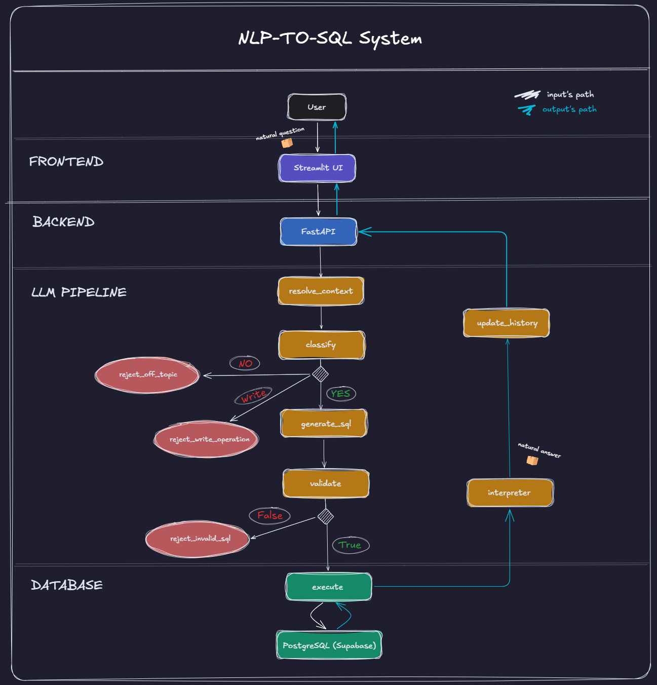

<h1 align="center">nlp-to-sql</h1>

<p align="center">
  A conversational Natural Language to SQL pipeline that lets you query a PostgreSQL database using natural language. Currently limited to safe <code>SELECT</code> queries.
</p>

<p align="center">
  <em>This is v1 — the foundation of a larger application. See <a href="#roadmap">Roadmap</a> for what's coming next.</em>
</p>

---

## Demo

### App
https://github.com/user-attachments/assets/your-app-video.mp4

### LangSmith Observability
https://github.com/user-attachments/assets/your-langsmith-video.mp4

<p align="center">
  
  
  
  
  
  
  
</p>

---

## Example

The best way to understand what this project does is to see conversational memory in action. A follow-up question with no explicit subject — "where are they from?" — is correctly resolved using the previous turn:

> **User:** Which customers never bought a Macbook?
>
> **Assistant:** Carol White and David Brown have never purchased a Macbook.

> **User:** Where are they from?
>
> **Assistant:** Carol White is from Albuquerque, NM. David Brown is from San Francisco, CA.

The second question contains no subject. The pipeline rewrites it internally as *"where are the customers who never bought a Macbook from?"* before generating SQL — no hardcoded logic, just context resolution.

---

## How It Works

Every question goes through a multi-step pipeline orchestrated by LangGraph:



| Step | Description |
|---|---|
| `resolve_context` | Rewrites ambiguous questions using conversation history (e.g. "where are they from?" → "where are the customers who never bought a Macbook from?") |
| `classify` | Determines if the question requires a database query, is a write operation, or should be rejected |
| `generate_sql` | Generates a syntactically correct PostgreSQL query |
| `validate` | Validates the SQL before execution |
| `execute` | Runs the query against the database |
| `interpret` | Translates the raw SQL result into a natural language answer |
| `update_history` | Saves the conversation turn for future context resolution |
| `reject_off_topic` | Rejects questions unrelated to the database |
| `reject_write_operation` | Rejects INSERT, UPDATE, DELETE and other write operations |
| `reject_invalid_sql` | Rejects queries that fail validation |

---

## Features

- **Conversational memory** — follow-up questions are resolved using previous context
- **Off-topic rejection** — non-database questions are gracefully declined
- **PostgreSQL-aware generation** — prompts enforce correct syntax (`EXTRACT`, `ILIKE`, `NOT IN`)
- **Safe execution** — only `SELECT` statements are allowed, validated before running
- **Observability** — full LangSmith tracing for every pipeline run
- **REST API** — FastAPI backend exposes the pipeline as an endpoint
- **Containerized** — Docker Compose setup for running the full stack locally

---

## Tech Stack

| Layer | Technology |
|---|---|
| Orchestration | [LangGraph](https://langchain-ai.github.io/langgraph/) |
| LLM | [Groq](https://groq.com) — Llama 3.3 70B |
| Database | [PostgreSQL](https://www.postgresql.org) via [Supabase](https://supabase.com) |
| Backend | [FastAPI](https://fastapi.tiangolo.com) |
| Frontend | [Streamlit](https://streamlit.io) |
| Observability | [LangSmith](https://smith.langchain.com) |
| ORM | [SQLAlchemy](https://www.sqlalchemy.org) |
| Containers | [Docker](https://www.docker.com) |
| Dependency Management | [Poetry](https://python-poetry.org) |

---

## Project Structure

```
nlp-to-sql/
├── app/
│   ├── api.py                      # FastAPI endpoints
│   └── streamlit_app.py            # Streamlit interface
├── core/
│   ├── config.py                   # Model and schema configuration
│   ├── graph.py                    # LangGraph pipeline definition
│   ├── logger.py                   # Logging setup
│   └── orchestrator.py             # Pipeline entry point
├── database/
│   ├── connection.py               # SQLAlchemy connection
│   ├── executor.py                 # Query execution
│   ├── schema.sql                  # Database schema
│   ├── seed.py                     # Seed data
│   └── validator.py                # SQL validation
├── llm/
│   ├── classifier.py               # Off-topic classifier
│   ├── client_groq.py              # Groq client
│   ├── context_resolver.py         # Pronoun/context resolution
│   ├── generator.py                # SQL generator
│   ├── interpreter.py              # Result interpreter
│   ├── postgresql_syntax.py        # PostgreSQL syntax reference
│   ├── prompts.py                  # System prompts for each pipeline step
│   └── description_prompts.md      # Detailed explanation of each prompt's design
├── logs/
│   ├── app_log                     # Application logs
├── .env.example
├── docker-compose.yml
└── Dockerfile
```

---

## Getting Started

### Prerequisites

- Python 3.12+
- Poetry
- A [Groq](https://console.groq.com) API key
- A [Supabase](https://supabase.com) PostgreSQL database
- A [LangSmith](https://smith.langchain.com) API key

### Installation

```bash
# Clone the repository
git clone https://github.com/marianamourapy/nlp-to-sql.git
cd nlp-to-sql

# Install dependencies
poetry install

# Set up environment variables
cp .env.example .env
# Edit .env with your API keys and database URL
```

### Database Setup

```bash
# Run schema and seed data
poetry run python database/seed.py
```

### Running the App

```bash
# Streamlit interface
poetry run streamlit run app/streamlit_app.py

# FastAPI backend
poetry run uvicorn app.api:app --reload
```

### Flexibility

The project was designed to avoid hardcoded values. LLM models, database connections, and schema configuration are all set via environment variables and `core/config.py` — so swapping Groq for another provider, or pointing to a different PostgreSQL database, requires no changes to the pipeline logic itself.

---

## Running with Docker

```bash
docker compose up --build
```

- Streamlit: http://localhost:8501
- FastAPI: http://localhost:8000

> Requires Docker Desktop installed.

---

## Environment Variables

Copy `.env.example` to `.env` and fill in your credentials:

```bash
cp .env.example .env
```

| Variable | Description |
|---|---|
| `GROQ_API_KEY` | Groq API key |
| `DATABASE_URL` | PostgreSQL connection string (Supabase Session Pooler) |
| `ENVIRONMENT` | `development` or `production` |
| `DEBUG` | `True` or `False` |
| `LANGCHAIN_API_KEY` | LangSmith API key |
| `LANGCHAIN_TRACING_V2` | Set to `true` to enable tracing |
| `LANGCHAIN_ENDPOINT` | LangSmith endpoint |

---

## Example Queries

Try these queries to explore the pipeline's capabilities:

**Basic queries**
```
what products do we have?
what is the most expensive product?
how many customers are there?
show me only 2 customers
```

**Aggregations & filtering**
```
which sales happened in january?
which month had the most sales?
what is the total revenue?
how many units of each product were sold?
```

**Joins & subqueries**
```
which customers never bought a macbook?
who bought more than one product?
what is the most purchased product?
```

**Conversational memory** — the pipeline resolves follow-up questions using previous context:
```
which customers never bought a macbook?
→ Carol White and David Brown have never purchased a Macbook.

where are they from?
→ Carol White is from Albuquerque, NM. David Brown is from San Francisco, CA.
```

**Off-topic rejection**
```
tell me a joke!
→ I can only answer questions about the store database.
```

**Write operation rejection**
```
update the client table with a new client
→ This application currently supports read-only queries. INSERT, UPDATE and DELETE operations are not available in this version.
```

---

## Roadmap

<a name="roadmap"></a>

This project started as a focused exercise in building a reliable NLP-to-SQL pipeline — one that handles conversational memory, edge cases, and observability from day one. But it was always designed with a bigger picture in mind.

The next versions will evolve this foundation into a multi-user platform where anyone can connect their own database and query it in plain language, without writing a single line of SQL. That means moving beyond the current read-only, single-database setup and building something genuinely useful in production environments.

Some of the directions planned for future versions:

- **Modern frontend** — replace Streamlit with a React interface for a richer, more responsive user experience
- **Multi-database support** — allow users to connect any PostgreSQL (or other) database dynamically, rather than a fixed schema
- **Write operations** — extend the pipeline to handle `UPDATE` and `DELETE` queries safely, with confirmation steps and rollback support
- **Authentication & multi-user** — user accounts, sessions, and per-user database connections
- **Security hardening** — role-based access control, query sanitization, and audit logging for production use

---

## License

MIT